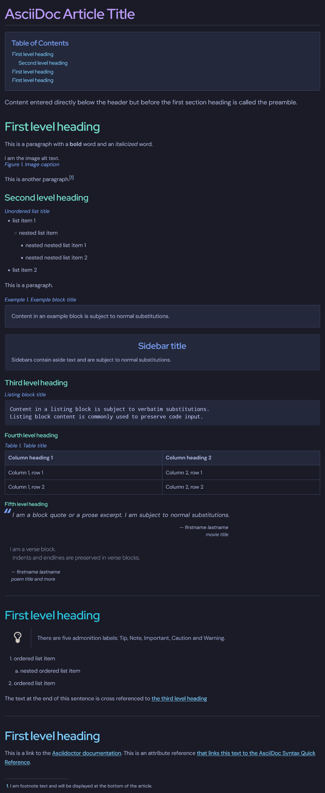

= AsciiDoc TokyoNight

Dark Mode Stylesheet for AsciiDoc based on the Tokyo Night colour scheme. +

Each section has a different colour for the headings within.

== Screenshot

== Credit

* Enkia for the original https://github.com/enkia/tokyo-night-vscode-theme[Tokyo Night VS Code Theme]

* AsciiDoctor for the https://github.com/asciidoctor/asciidoctor/blob/v2.0.x/src/stylesheets/asciidoctor.css[Default Stylesheet]
